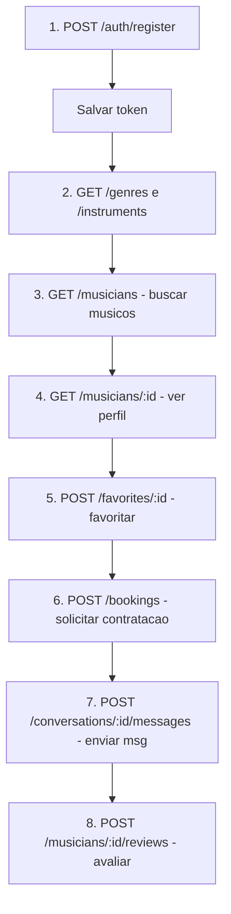

# Analise do Backend ContrataMúsico e Guia de Testes via Postman

## Status do Backend

Seu backend esta **praticamente finalizado** para um MVP! Baseado no plano de implementacao, todos os modulos foram concluidos:| Modulo | Status ||--------|--------|| Autenticacao (JWT, registro, login, recuperacao de senha) | Completo || Musicos (busca, perfil, filtros) | Completo || Portfolio (upload de imagens, videos, audios) | Completo || Favoritos | Completo || Chat/Mensagens | Completo || Bookings/Agendamentos | Completo || Avaliacoes | Completo || Planos de Assinatura | Completo || FAQ | Completo || Contato | Completo || Pagamentos | Parcial (estrutura pronta, falta Stripe real) || Painel Admin | Completo || Swagger/Documentacao | Completo |---

## Como Testar via Postman

### 1. Iniciar o Backend

```bash
cd C:\projetos\CONTRATA-MUSICO\contratamusico-backend
npm run start:dev
```

O servidor iniciara na porta **3000** (ou a definida em `PORT` no `.env`).

### 2. Acessar Documentacao Swagger

Abra no navegador: **http://localhost:3000/api**O Swagger ja esta configurado com todos os endpoints documentados, incluindo exemplos de request/response.---

## Mapa Completo de Endpoints para Postman

### Autenticacao (`/auth`)

| Metodo | Endpoint | Descricao | Auth ||--------|----------|-----------|------|| POST | `/auth/register` | Registrar usuario (cliente ou musico) | Nao || POST | `/auth/login` | Login com email/senha | Nao || POST | `/auth/forgot-password` | Solicitar recuperacao de senha | Nao || POST | `/auth/reset-password` | Redefinir senha com token | Nao |

### Usuarios (`/users`)

| Metodo | Endpoint | Descricao | Auth ||--------|----------|-----------|------|| GET | `/users/me` | Dados do usuario logado | Sim || PATCH | `/users/me` | Atualizar dados do usuario | Sim || POST | `/users/me/avatar` | Upload de foto de perfil | Sim |

### Musicos (`/musicians`)

| Metodo | Endpoint | Descricao | Auth ||--------|----------|-----------|------|| GET | `/musicians` | Buscar musicos com filtros | Nao || GET | `/musicians/featured` | Musicos em destaque | Nao || GET | `/musicians/:id` | Perfil publico do musico | Nao || GET | `/musicians/me` | Meu perfil de musico | Sim (musico) || PATCH | `/musicians/me` | Atualizar meu perfil | Sim (musico) || PATCH | `/musicians/me/genres` | Atualizar meus generos | Sim (musico) || PATCH | `/musicians/me/instruments` | Atualizar instrumentos | Sim (musico) |

### Portfolio (`/musicians/.../portfolio`)

| Metodo | Endpoint | Descricao | Auth ||--------|----------|-----------|------|| GET | `/musicians/:id/portfolio` | Portfolio publico | Nao || GET | `/musicians/me/portfolio` | Meu portfolio | Sim (musico) || POST | `/musicians/me/portfolio` | Adicionar item | Sim (musico) || POST | `/musicians/me/portfolio/upload` | Upload de arquivo | Sim (musico) || PATCH | `/musicians/me/portfolio/:id` | Atualizar item | Sim (musico) || DELETE | `/musicians/me/portfolio/:id` | Remover item | Sim (musico) |

### Favoritos (`/favorites`)

| Metodo | Endpoint | Descricao | Auth ||--------|----------|-----------|------|| GET | `/favorites` | Meus favoritos | Sim || GET | `/favorites/count` | Total de favoritos | Sim || GET | `/favorites/check/:musicianId` | Verificar se e favorito | Sim || POST | `/favorites/:musicianId` | Adicionar favorito | Sim || DELETE | `/favorites/:musicianId` | Remover favorito | Sim |

### Chat/Mensagens (`/conversations`)

| Metodo | Endpoint | Descricao | Auth ||--------|----------|-----------|------|| GET | `/conversations` | Minhas conversas | Sim || GET | `/conversations/:id` | Detalhes da conversa | Sim || GET | `/conversations/unread/count` | Mensagens nao lidas | Sim || POST | `/conversations/:musicianId/messages` | Enviar mensagem | Sim || PATCH | `/conversations/:id/read` | Marcar como lida | Sim |

### Agendamentos (`/bookings`)

| Metodo | Endpoint | Descricao | Auth ||--------|----------|-----------|------|| POST | `/bookings` | Criar solicitacao | Opcional || GET | `/bookings` | Meus agendamentos | Sim || GET | `/bookings/:id` | Detalhes do agendamento | Sim || PATCH | `/bookings/:id/status` | Atualizar status | Sim |

### Avaliacoes (`/musicians/:musicianId/reviews`)

| Metodo | Endpoint | Descricao | Auth ||--------|----------|-----------|------|| GET | `/musicians/:id/reviews` | Avaliacoes do musico | Nao || GET | `/musicians/:id/reviews/stats` | Estatisticas | Nao || POST | `/musicians/:id/reviews` | Criar avaliacao | Sim (cliente) |

### Dados Auxiliares

| Metodo | Endpoint | Descricao | Auth ||--------|----------|-----------|------|| GET | `/genres` | Listar generos musicais | Nao || GET | `/instruments` | Listar instrumentos | Nao || GET | `/locations/states` | Estados brasileiros | Nao || GET | `/locations/cities/:uf` | Cidades por estado | Nao || GET | `/plans` | Planos de assinatura | Nao || GET | `/plans/:id` | Detalhes do plano | Nao || GET | `/faq` | Perguntas frequentes | Nao || GET | `/faq/grouped` | FAQs por categoria | Nao || POST | `/contact` | Enviar mensagem de contato | Nao |

### Pagamentos (`/payments`)

| Metodo | Endpoint | Descricao | Auth ||--------|----------|-----------|------|| GET | `/payments/subscription` | Minha assinatura | Sim || GET | `/payments/history` | Historico de pagamentos | Sim |

### Admin (`/admin`) - Apenas Administradores

| Metodo | Endpoint | Descricao | Auth ||--------|----------|-----------|------|| GET | `/admin/dashboard` | Metricas gerais | Sim (admin) || GET | `/admin/users` | Listar usuarios | Sim (admin) || GET | `/admin/musicians` | Listar musicos | Sim (admin) || PATCH | `/admin/musicians/:id/featured` | Toggle destaque | Sim (admin) |---

## Configuracao do Postman

### 1. Criar Environment

Crie um environment com estas variaveis:

```javascript
base_url: http://localhost:3000
token: (deixar vazio inicialmente)
```


### 2. Fluxo de Teste Recomendado




### 3. Exemplo de Request - Registro

```json
POST http://localhost:3000/auth/register
Content-Type: application/json

{
  "email": "teste@exemplo.com",
  "password": "Senha@123",
  "firstName": "Joao",
  "lastName": "Silva",
  "userType": "MUSICIAN",
  "terms": true
}
```


### 4. Configurar Authorization

Apos login/registro, copie o `access_token` e configure no Postman:

- Type: **Bearer Token**
- Token: `{{token}}`

---

## O que Falta para Producao

1. **Stripe Real**: Os endpoints de pagamento existem mas precisam do Stripe configurado
2. **Variaveis de Ambiente**: Configurar `.env` com credenciais reais (AWS S3, SMTP, Stripe)
3. **Dados Iniciais**: Rodar seed para popular generos, instrumentos e planos
```bash
npx prisma db push
npm run seed


```