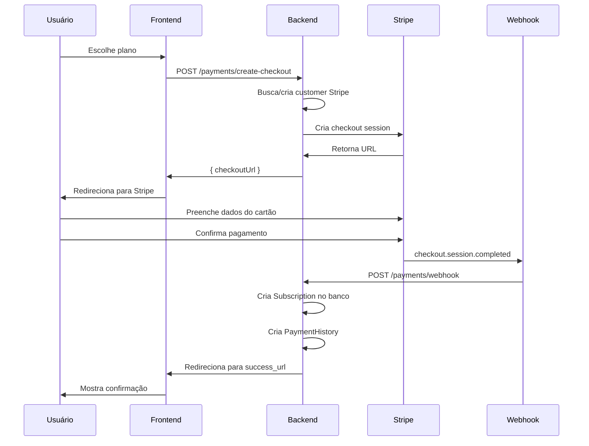

# 💳 Plano de Implementação: Integração Completa com Stripe

## 📊 Visão Geral

**Objetivo:** Implementar sistema completo de pagamentos recorrentes com Stripe para monetização da plataforma

**Status Atual:** ✅ 100% IMPLEMENTADO

**Tempo Estimado:** 3-5 dias

**Prioridade:** 🔴 CRÍTICA---

## 🎯 Escopo da Implementação

### O que será implementado:

1. **Instalação e Configuração**

- SDK do Stripe no backend
- Variáveis de ambiente
- Configuração de webhooks

2. **Gerenciamento de Customers**

- Criar customer no Stripe ao criar usuário
- Vincular customer ID ao usuário no banco

3. **Checkout de Assinaturas**

- Criar sessão de checkout
- Redirecionar para página de pagamento Stripe
- Processar confirmação de pagamento

4. **Webhooks**

- Receber eventos do Stripe
- Processar diferentes tipos de eventos
- Atualizar banco de dados de acordo

5. **Gerenciamento de Assinaturas**

- Cancelar assinatura
- Portal do cliente (Stripe Customer Portal)
- Atualizar status de assinatura

6. **Registro de Transações**

- Salvar histórico de pagamentos
- Tracking de status

---

## 📋 Checklist de Implementação

### Fase 1: Setup e Configuração

- [x] Instalar dependência `stripe` via npm
- [x] Adicionar variáveis de ambiente no `.env`:
- `STRIPE_SECRET_KEY`
- `STRIPE_PUBLISHABLE_KEY`
- `STRIPE_WEBHOOK_SECRET`
- `STRIPE_SUCCESS_URL`
- `STRIPE_CANCEL_URL`
- [x] Adicionar exemplo no `.env.example`
- [ ] Documentar configuração no README

### Fase 2: Stripe Service (Core)

**Arquivo:** `src/payment/stripe.service.ts`

- [x] Importar e configurar SDK do Stripe
- [x] Método: `createCustomer(email, name)` - Criar customer no Stripe
- [x] Método: `getCustomer(customerId)` - Buscar customer
- [x] Método: `createCheckoutSession(customerId, priceId, planId)` - Criar sessão de checkout
- [x] Método: `cancelSubscription(subscriptionId)` - Cancelar assinatura
- [x] Método: `createPortalSession(customerId)` - Criar sessão do portal
- [x] Método: `constructWebhookEvent(payload, signature)` - Validar webhook
- [x] Método auxiliar: `getPriceIdForPlan(planId, interval)` - Mapear plano para price ID

### Fase 3: Payment Service (Lógica de Negócio)

**Arquivo:** `src/payment/payment.service.ts`

- [x] Método: `createCheckout(userId, planId, billingInterval)`:
- Buscar usuário
- Criar/buscar customer no Stripe
- Salvar `stripeCustomerId` no banco
- Criar checkout session
- Retornar URL do checkout

- [x] Método: `handleCheckoutComplete(session)`:
- Extrair dados da sessão
- Criar registro em `Subscription`
- Salvar `stripeSubscriptionId`
- Criar registro em `PaymentHistory`
- Enviar email de confirmação

- [x] Método: `handleSubscriptionUpdated(subscription)`:
- Buscar subscription no banco por `stripeSubscriptionId`
- Atualizar status
- Atualizar `currentPeriodEnd`

- [x] Método: `handleSubscriptionDeleted(subscription)`:
- Marcar como cancelada
- Manter acesso até fim do período

- [x] Método: `handleInvoicePaymentFailed(invoice)`:
- Registrar falha em `PaymentHistory`
- Enviar email de aviso
- Atualizar status para `past_due`

- [x] Método: `cancelSubscription(userId)`:
- Buscar subscription do usuário
- Cancelar no Stripe
- Marcar `cancelAtPeriodEnd = true`
- Manter acesso até fim do período

- [x] Método: `createPortalSession(userId, returnUrl)`:
- Buscar `stripeCustomerId`
- Criar portal session
- Retornar URL

### Fase 4: Payment Controller (Endpoints)

**Arquivo:** `src/payment/payment.controller.ts`

- [x] Endpoint: `POST /payments/create-checkout`
- DTO: `CreateCheckoutDto` (planId, billingInterval: monthly/yearly)
- Autenticação: JWT required
- Response: `{ checkoutUrl: string }`

- [x] Endpoint: `POST /payments/webhook`
- Raw body parser (Stripe exige body raw)
- Validar signature do webhook
- Processar evento baseado no tipo
- Response: `{ received: true }`

- [x] Endpoint: `POST /payments/cancel`
- Autenticação: JWT required
- Cancelar assinatura do usuário logado
- Response: `{ message: string, subscription }`

- [x] Endpoint: `POST /payments/portal`
- DTO: `CreatePortalDto` (returnUrl opcional)
- Autenticação: JWT required
- Response: `{ portalUrl: string }`

- [x] Endpoint: `POST /payments/reactivate` (BÔNUS)
- Autenticação: JWT required
- Reativar assinatura cancelada
- Response: `{ message: string, subscription }`

### Fase 5: DTOs de Validação

**Criar arquivos:**

- [x] `src/payment/dto/create-checkout.dto.ts`:
  ```typescript
    - planId: number (required)
    - billingInterval: 'monthly' | 'yearly' (required)
  ```

- [x] `src/payment/dto/create-portal.dto.ts`:
  ```typescript
    - returnUrl?: string (optional)
  ```


### Fase 6: Configuração de Webhook

**Backend:**

- [x] Configurar endpoint `/payments/webhook` para aceitar raw body
- [x] Adicionar exceção no middleware de JSON parsing
- [x] Adicionar tratamento de erros específico

**No Stripe Dashboard:**

- [ ] Criar webhook endpoint apontando para: `https://sua-api.com/payments/webhook`
- [ ] Selecionar eventos:
- `checkout.session.completed`
- `customer.subscription.updated`
- `customer.subscription.deleted`
- `invoice.payment_failed`
- `invoice.payment_succeeded`
- [ ] Copiar webhook secret para `.env`

### Fase 7: Integração com User Creation

**Arquivo:** `src/user/user.service.ts`

- [x] Customer no Stripe é criado no momento do checkout (lazy creation)
- [x] `stripeCustomerId` é salvo na tabela Subscription (já existe no schema)
- [x] Erro no Stripe não bloqueia cadastro (customer criado apenas no checkout)

### Fase 8: Price IDs do Stripe

**Criar produtos no Stripe Dashboard:**

- [ ] Produto: "Plano Básico" (R$ 0,00)
- Price ID mensalidade: `price_basic_monthly`
- Price ID anual: `price_basic_yearly`

- [ ] Produto: "Plano Profissional" (R$ 49,90/mês ou R$ 479,00/ano)
- Price ID mensalidade: `price_professional_monthly`
- Price ID anual: `price_professional_yearly`

- [ ] Produto: "Plano Premium" (R$ 99,90/mês ou R$ 959,00/ano)
- Price ID mensalidade: `price_premium_monthly`
- Price ID anual: `price_premium_yearly`

**Mapear no código:**

- [x] Criar arquivo de configuração: `src/payment/stripe.config.ts`
- [x] Mapear `planId` do banco para `priceId` do Stripe

### Fase 9: Tratamento de Erros

- [ ] Try-catch em todas as chamadas do Stripe
- [ ] Logs estruturados de erros
- [ ] Mensagens de erro amigáveis para o usuário
- [ ] Retry automático em caso de falha temporária (webhook)

### Fase 10: Testes

- [ ] Testes unitários do StripeService
- [ ] Testes unitários do PaymentService
- [ ] Testes de integração dos endpoints
- [ ] Testes com Stripe Test Mode:
- Checkout bem-sucedido
- Checkout cancelado
- Pagamento recorrente
- Falha de pagamento
- Cancelamento de assinatura
- Webhook events

### Fase 11: Documentação

- [ ] Atualizar Swagger com novos endpoints
- [ ] Documentar fluxo de pagamento na DOCUMENTACAO.md
- [ ] Criar diagrama de sequência do fluxo
- [ ] Documentar como testar com Stripe CLI
- [ ] Adicionar troubleshooting comum

---

## 📁 Estrutura de Arquivos

```javascript
src/payment/
├── stripe.service.ts          ✏️ EXPANDIR
├── payment.service.ts         ✏️ EXPANDIR
├── payment.controller.ts      ✏️ EXPANDIR
├── payment.module.ts          ✅ JÁ EXISTE
├── stripe.config.ts           🆕 CRIAR
├── dto/
│   ├── create-checkout.dto.ts 🆕 CRIAR
│   └── create-portal.dto.ts   🆕 CRIAR
```

---

## 🔧 Código Base para Implementação

### 1. stripe.service.ts (Expandido)

```typescript
import { Injectable } from '@nestjs/common';
import Stripe from 'stripe';

@Injectable()
export class StripeService {
  private stripe: Stripe;

  constructor() {
    this.stripe = new Stripe(process.env.STRIPE_SECRET_KEY, {
      apiVersion: '2023-10-16',
    });
  }

  // Criar customer no Stripe
  async createCustomer(email: string, name: string): Promise<Stripe.Customer> {
    return await this.stripe.customers.create({
      email,
      name,
      metadata: {
        platform: 'contratamusico',
      },
    });
  }

  // Buscar customer
  async getCustomer(customerId: string): Promise<Stripe.Customer> {
    return await this.stripe.customers.retrieve(customerId) as Stripe.Customer;
  }

  // Criar checkout session
  async createCheckoutSession(
    customerId: string,
    priceId: string,
    metadata: { planId: string; userId: string },
  ): Promise<Stripe.Checkout.Session> {
    return await this.stripe.checkout.sessions.create({
      customer: customerId,
      mode: 'subscription',
      payment_method_types: ['card'],
      line_items: [
        {
          price: priceId,
          quantity: 1,
        },
      ],
      success_url: `${process.env.FRONTEND_URL}/pagamento/sucesso?session_id={CHECKOUT_SESSION_ID}`,
      cancel_url: `${process.env.FRONTEND_URL}/planos?canceled=true`,
      metadata,
    });
  }

  // Cancelar assinatura
  async cancelSubscription(subscriptionId: string): Promise<Stripe.Subscription> {
    return await this.stripe.subscriptions.update(subscriptionId, {
      cancel_at_period_end: true,
    });
  }

  // Criar portal session
  async createPortalSession(
    customerId: string,
    returnUrl: string,
  ): Promise<Stripe.BillingPortal.Session> {
    return await this.stripe.billingPortal.sessions.create({
      customer: customerId,
      return_url: returnUrl,
    });
  }

  // Construir evento de webhook
  constructWebhookEvent(
    payload: Buffer,
    signature: string,
  ): Stripe.Event {
    return this.stripe.webhooks.constructEvent(
      payload,
      signature,
      process.env.STRIPE_WEBHOOK_SECRET,
    );
  }

  // Mapear plano para price ID
  getPriceIdForPlan(planId: number, interval: 'monthly' | 'yearly'): string {
    // Mapeamento baseado nos planos no banco
    const priceMap = {
      1: { // Básico
        monthly: null, // Grátis
        yearly: null,
      },
      2: { // Profissional
        monthly: process.env.STRIPE_PRICE_PROFESSIONAL_MONTHLY,
        yearly: process.env.STRIPE_PRICE_PROFESSIONAL_YEARLY,
      },
      3: { // Premium
        monthly: process.env.STRIPE_PRICE_PREMIUM_MONTHLY,
        yearly: process.env.STRIPE_PRICE_PREMIUM_YEARLY,
      },
    };

    return priceMap[planId]?.[interval];
  }
}
```

### 2. create-checkout.dto.ts

```typescript
import { IsNotEmpty, IsNumber, IsIn } from 'class-validator';
import { ApiProperty } from '@nestjs/swagger';

export class CreateCheckoutDto {
  @ApiProperty({
    description: 'ID do plano de assinatura',
    example: 2,
  })
  @IsNotEmpty()
  @IsNumber()
  planId: number;

  @ApiProperty({
    description: 'Intervalo de cobrança',
    enum: ['monthly', 'yearly'],
    example: 'monthly',
  })
  @IsNotEmpty()
  @IsIn(['monthly', 'yearly'])
  billingInterval: 'monthly' | 'yearly';
}
```

### 3. payment.controller.ts - Novos Endpoints

```typescript
@Post('create-checkout')
@UseGuards(JwtAuthGuard)
@HttpCode(HttpStatus.OK)
async createCheckout(
  @Req() req: any,
  @Body() data: CreateCheckoutDto,
) {
  const checkoutUrl = await this.paymentService.createCheckout(
    req.user.id,
    data.planId,
    data.billingInterval,
  );
  return { checkoutUrl };
}

@Post('webhook')
@HttpCode(HttpStatus.OK)
async handleWebhook(
  @Req() req: any,
  @Headers('stripe-signature') signature: string,
) {
  const rawBody = req.rawBody; // Precisa configurar raw body parser
  await this.paymentService.handleWebhook(rawBody, signature);
  return { received: true };
}

@Post('cancel')
@UseGuards(JwtAuthGuard)
@HttpCode(HttpStatus.OK)
async cancelSubscription(@Req() req: any) {
  return this.paymentService.cancelSubscription(req.user.id);
}

@Post('portal')
@UseGuards(JwtAuthGuard)
@HttpCode(HttpStatus.OK)
async createPortalSession(
  @Req() req: any,
  @Body() data: CreatePortalDto,
) {
  const portalUrl = await this.paymentService.createPortalSession(
    req.user.id,
    data.returnUrl || process.env.FRONTEND_URL,
  );
  return { portalUrl };
}
```

### 4. main.ts - Configurar Raw Body para Webhook

```typescript
// Adicionar antes de app.useGlobalPipes()
app.use('/payments/webhook', express.raw({ type: 'application/json' }));
```

---

## 🔄 Fluxo de Pagamento Completo

### Diagrama de Sequência



---

## 🧪 Como Testar

### 1. Setup Local

```bash
# Instalar Stripe CLI
brew install stripe/stripe-cli/stripe

# Login
stripe login

# Forward webhooks para localhost
stripe listen --forward-to localhost:3000/payments/webhook

# Copiar webhook secret que aparece no console
```

### 2. Cartões de Teste

```javascript
Sucesso: 4242 4242 4242 4242
Falha: 4000 0000 0000 0002
3D Secure: 4000 0025 0000 3155
```

### 3. Testar Fluxo Completo

1. Criar usuário
2. Fazer checkout
3. Pagar com cartão de teste
4. Verificar webhook no terminal
5. Verificar registro no banco
6. Testar cancelamento
7. Testar portal do cliente

---

## ⚠️ Pontos de Atenção

### Segurança

- ✅ NUNCA expor `STRIPE_SECRET_KEY` no frontend
- ✅ Validar SEMPRE a signature do webhook
- ✅ Usar HTTPS em produção
- ✅ Rate limiting no webhook endpoint

### Performance

- ✅ Processar webhooks de forma assíncrona se possível
- ✅ Retry automático com exponential backoff
- ✅ Timeout adequado nas chamadas Stripe (30s)

### Idempotência

- ✅ Usar `idempotencyKey` em operações críticas
- ✅ Verificar se subscription já existe antes de criar
- ✅ Evitar processar o mesmo evento duas vezes

### Experiência do Usuário

- ✅ Mensagens de erro claras
- ✅ Loading states durante checkout
- ✅ Email de confirmação após pagamento
- ✅ Manter acesso até fim do período em caso de cancelamento

---

## 📊 Métricas de Sucesso

- [ ] Taxa de conversão no checkout > 70%
- [ ] Webhooks processados em < 5 segundos
- [ ] Zero erros não tratados
- [ ] Logs completos de todas as transações
- [ ] Email de confirmação enviado em 100% dos casos

---

## 🚀 Deploy Checklist

- [ ] Configurar variáveis de ambiente em produção
- [ ] Criar produtos e prices no Stripe Dashboard (live mode)
- [ ] Configurar webhook na URL de produção
- [ ] Testar fluxo completo em staging
- [ ] Monitorar webhooks no Stripe Dashboard
- [ ] Configurar alertas para falhas de pagamento
- [ ] Documentar processo de suporte para clientes

---

## 📚 Recursos

- [Stripe Checkout Docs](https://stripe.com/docs/payments/checkout)
- [Stripe Subscriptions](https://stripe.com/docs/billing/subscriptions/overview)
- [Stripe Webhooks](https://stripe.com/docs/webhooks)
- [Stripe Testing](https://stripe.com/docs/testing)
- [Stripe CLI](https://stripe.com/docs/stripe-cli)

---**Estimativa Final:** 3-5 dias de desenvolvimento + 1 dia de testes

**Complexidade:** Média-Alta