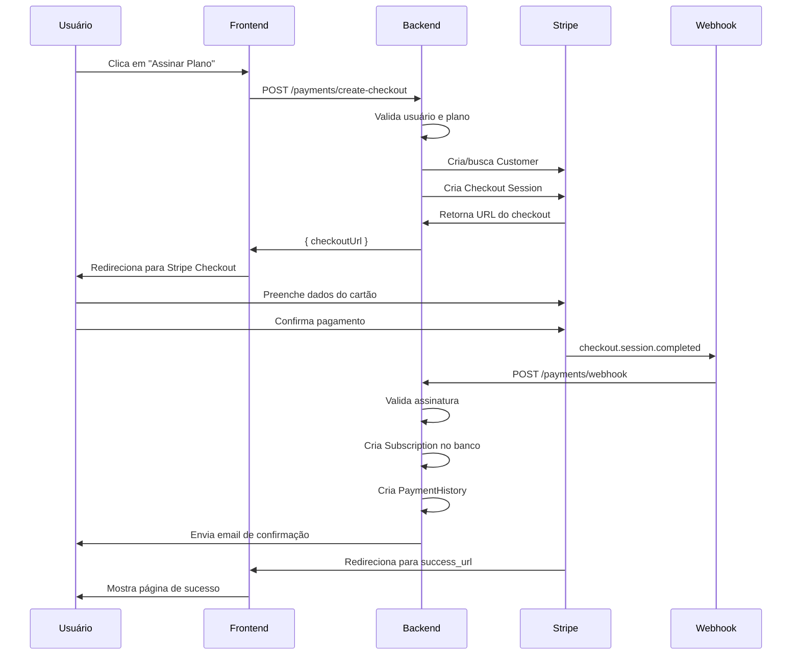
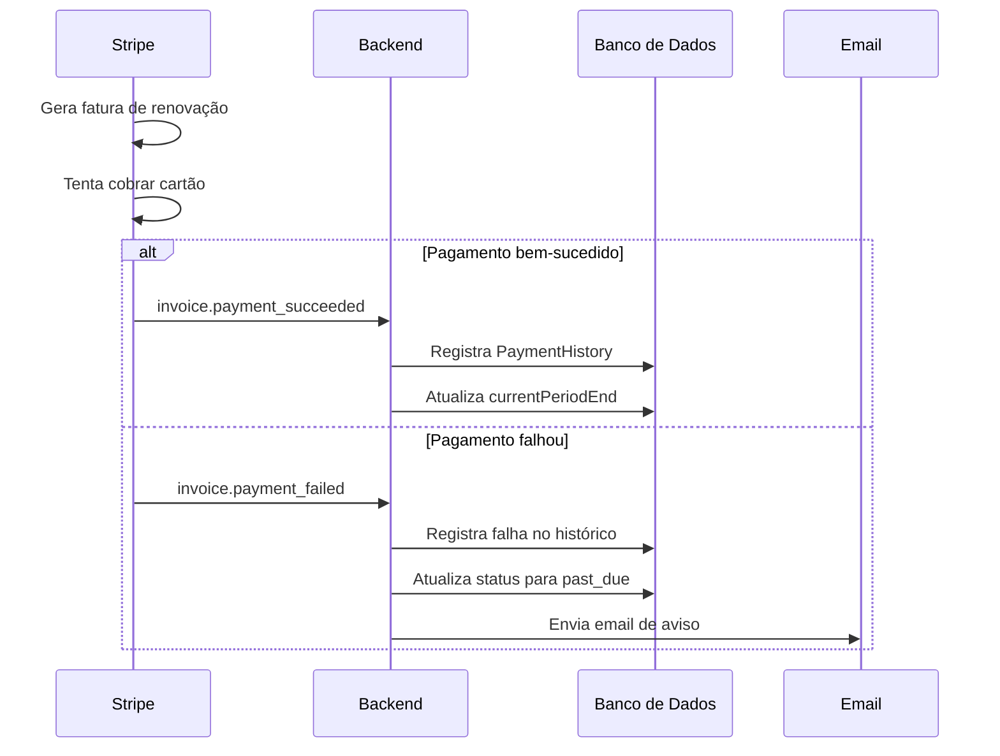
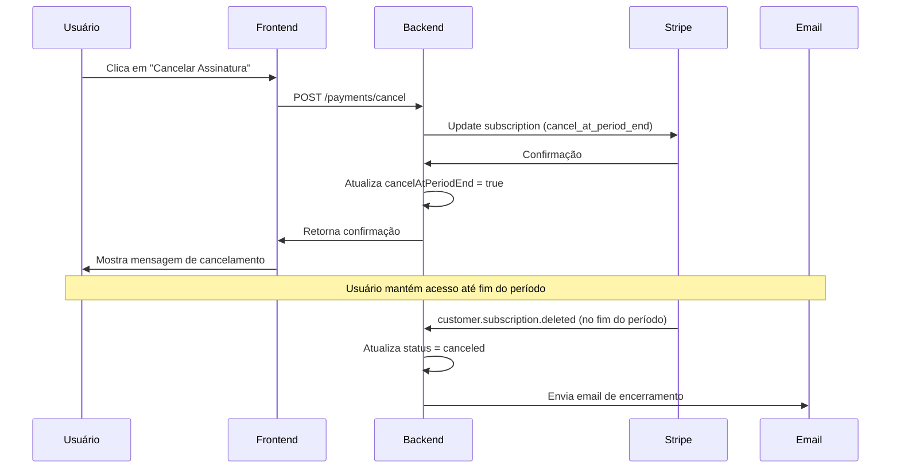

# 💳 Integração com Stripe - ContrataMúsico

## Visão Geral

A plataforma ContrataMúsico utiliza o **Stripe** como provedor de pagamentos para gerenciar assinaturas recorrentes dos planos Premium oferecidos aos músicos e clientes.

---

## 🏗️ Arquitetura

### Estrutura de Arquivos

```
src/payment/
├── stripe.config.ts       # Configuração e mapeamento de planos
├── stripe.service.ts      # Comunicação direta com a API do Stripe
├── payment.service.ts     # Lógica de negócio de pagamentos
├── payment.controller.ts  # Endpoints REST
├── payment.module.ts      # Módulo NestJS
└── dto/
    ├── create-checkout.dto.ts   # DTO para criar checkout
    ├── create-portal.dto.ts     # DTO para portal do cliente
    └── index.ts                 # Barrel export
```

### Fluxo de Dados

```
Frontend → PaymentController → PaymentService → StripeService → Stripe API
                                    ↓
                              PrismaService (Banco de Dados)
                                    ↓
                              EmailService (Notificações)
```

---

## 📊 Modelos de Dados

### Subscription (Assinatura)

| Campo | Tipo | Descrição |
|-------|------|-----------|
| `id` | Int | ID único da assinatura |
| `userId` | Int | ID do usuário (FK) |
| `planId` | Int | ID do plano (FK) |
| `stripeSubscriptionId` | String? | ID da subscription no Stripe |
| `stripeCustomerId` | String? | ID do customer no Stripe |
| `status` | String | Status: `active`, `canceled`, `past_due`, `incomplete` |
| `currentPeriodStart` | DateTime | Início do período atual |
| `currentPeriodEnd` | DateTime | Fim do período atual |
| `cancelAtPeriodEnd` | Boolean | Se cancela no fim do período |

### PaymentHistory (Histórico de Pagamentos)

| Campo | Tipo | Descrição |
|-------|------|-----------|
| `id` | Int | ID único |
| `userId` | Int | ID do usuário (FK) |
| `amount` | Int | Valor em centavos |
| `currency` | String | Moeda (padrão: BRL) |
| `status` | String | Status: `succeeded`, `failed`, `pending`, `refunded` |
| `stripePaymentId` | String? | ID do PaymentIntent no Stripe |
| `description` | String? | Descrição do pagamento |

---

## 🔌 Endpoints da API

### 1. Obter Assinatura Atual

```http
GET /payments/subscription
Authorization: Bearer {token}
```

**Resposta:**
```json
{
  "hasSubscription": true,
  "subscription": {
    "id": 1,
    "status": "active",
    "currentPeriodStart": "2024-01-01T00:00:00Z",
    "currentPeriodEnd": "2024-02-01T00:00:00Z",
    "cancelAtPeriodEnd": false,
    "plan": {
      "id": 2,
      "title": "Profissional",
      "monthlyPrice": 4990,
      "features": [...]
    }
  }
}
```

---

### 2. Histórico de Pagamentos

```http
GET /payments/history?page=1&limit=10
Authorization: Bearer {token}
```

**Resposta:**
```json
{
  "data": [
    {
      "id": 1,
      "amount": 4990,
      "currency": "BRL",
      "status": "succeeded",
      "description": "Assinatura Profissional - 08/01/2026",
      "createdAt": "2026-01-08T10:30:00Z"
    }
  ],
  "pagination": {
    "page": 1,
    "limit": 10,
    "total": 5,
    "totalPages": 1
  }
}
```

---

### 3. Criar Checkout (Iniciar Assinatura)

```http
POST /payments/create-checkout
Authorization: Bearer {token}
Content-Type: application/json

{
  "planId": 2,
  "billingInterval": "monthly"
}
```

**Parâmetros:**
| Campo | Tipo | Obrigatório | Descrição |
|-------|------|-------------|-----------|
| `planId` | number | Sim | ID do plano (2 = Profissional, 3 = Premium) |
| `billingInterval` | string | Sim | `"monthly"` ou `"yearly"` |

**Resposta:**
```json
{
  "checkoutUrl": "https://checkout.stripe.com/c/pay/cs_test_..."
}
```

**Erros Possíveis:**
- `400` - Plano gratuito não requer pagamento
- `400` - Já possui assinatura ativa
- `404` - Plano não encontrado

---

### 4. Webhook do Stripe

```http
POST /payments/webhook
stripe-signature: {signature}
Content-Type: application/json

{raw body}
```

> ⚠️ Este endpoint é chamado automaticamente pelo Stripe e não deve ser acessado manualmente.

**Eventos Processados:**
- `checkout.session.completed` - Checkout concluído com sucesso
- `customer.subscription.updated` - Assinatura atualizada
- `customer.subscription.deleted` - Assinatura cancelada
- `invoice.payment_succeeded` - Pagamento de fatura bem-sucedido
- `invoice.payment_failed` - Falha no pagamento da fatura

---

### 5. Cancelar Assinatura

```http
POST /payments/cancel
Authorization: Bearer {token}
```

**Resposta:**
```json
{
  "message": "Sua assinatura será cancelada em 01/02/2026. Você continuará tendo acesso até essa data.",
  "subscription": {
    "id": 1,
    "status": "active",
    "currentPeriodEnd": "2026-02-01T00:00:00Z",
    "cancelAtPeriodEnd": true,
    "plan": {...}
  }
}
```

> ℹ️ O cancelamento é feito no final do período pago. O usuário mantém acesso até a data de expiração.

---

### 6. Reativar Assinatura

```http
POST /payments/reactivate
Authorization: Bearer {token}
```

**Resposta:**
```json
{
  "message": "Sua assinatura foi reativada com sucesso!",
  "subscription": {
    "id": 1,
    "status": "active",
    "currentPeriodEnd": "2026-02-01T00:00:00Z",
    "cancelAtPeriodEnd": false,
    "plan": {...}
  }
}
```

> ℹ️ Só funciona se a assinatura foi cancelada mas ainda não expirou.

---

### 7. Portal do Cliente

```http
POST /payments/portal
Authorization: Bearer {token}
Content-Type: application/json

{
  "returnUrl": "https://contratamusico.com/perfil"
}
```

**Resposta:**
```json
{
  "portalUrl": "https://billing.stripe.com/p/session/..."
}
```

O portal do cliente permite:
- Atualizar método de pagamento
- Ver histórico de faturas
- Baixar recibos
- Gerenciar assinatura

---

## 🔄 Fluxos de Pagamento

### Fluxo de Nova Assinatura



### Fluxo de Renovação Automática



### Fluxo de Cancelamento



---

## 💰 Planos e Preços

### Mapeamento de Planos

| Plan ID | Nome | Preço Mensal | Preço Anual | Stripe Price ID |
|---------|------|--------------|-------------|-----------------|
| 1 | Básico | R$ 0,00 | R$ 0,00 | - (gratuito) |
| 2 | Profissional | R$ 49,90 | R$ 479,00 | env vars |
| 3 | Premium | R$ 99,90 | R$ 959,00 | env vars |

### Configuração no Código

```typescript
// src/payment/stripe.config.ts
export const STRIPE_PLANS = {
  1: {
    name: 'Básico',
    monthlyPriceCents: 0,
    yearlyPriceCents: 0,
    prices: { monthly: null, yearly: null },
  },
  2: {
    name: 'Profissional',
    monthlyPriceCents: 4990,
    yearlyPriceCents: 47900,
    prices: {
      monthly: process.env.STRIPE_PRICE_PROFESSIONAL_MONTHLY,
      yearly: process.env.STRIPE_PRICE_PROFESSIONAL_YEARLY,
    },
  },
  3: {
    name: 'Premium',
    monthlyPriceCents: 9990,
    yearlyPriceCents: 95900,
    prices: {
      monthly: process.env.STRIPE_PRICE_PREMIUM_MONTHLY,
      yearly: process.env.STRIPE_PRICE_PREMIUM_YEARLY,
    },
  },
};
```

---

## 📧 Notificações por Email

### Emails Enviados

| Evento | Template | Descrição |
|--------|----------|-----------|
| Pagamento confirmado | `sendPaymentConfirmationEmail` | Enviado após checkout bem-sucedido |
| Falha no pagamento | `sendPaymentFailedEmail` | Enviado quando cobrança falha |
| Assinatura cancelada | `sendSubscriptionCanceledEmail` | Enviado quando assinatura é cancelada |

### Exemplo de Email de Confirmação

```
✅ Pagamento Confirmado!

Olá, João!

Seu pagamento foi processado com sucesso! 🎉

Plano: Profissional
Valor: R$ 49,90
Status: Ativo

[Acessar Minha Conta]

Atenciosamente,
Equipe ContrataMúsico
```

---

## 🔧 Configuração

### Variáveis de Ambiente

```bash
# .env

# Chaves do Stripe
STRIPE_SECRET_KEY=sk_test_...        # ou sk_live_... em produção
STRIPE_PUBLISHABLE_KEY=pk_test_...   # ou pk_live_... em produção
STRIPE_WEBHOOK_SECRET=whsec_...

# Price IDs dos planos (criar no Stripe Dashboard)
STRIPE_PRICE_PROFESSIONAL_MONTHLY=price_...
STRIPE_PRICE_PROFESSIONAL_YEARLY=price_...
STRIPE_PRICE_PREMIUM_MONTHLY=price_...
STRIPE_PRICE_PREMIUM_YEARLY=price_...

# URLs
FRONTEND_URL=http://localhost:3001
```

### Configuração no Stripe Dashboard

1. **Criar Produtos:**
   - Produto "Plano Profissional"
   - Produto "Plano Premium"

2. **Criar Preços (Prices):**
   - Para cada produto, criar preço mensal e anual
   - Configurar como "Recurring" (recorrente)
   - Moeda: BRL

3. **Configurar Webhook:**
   - URL: `https://sua-api.com/payments/webhook`
   - Eventos:
     - `checkout.session.completed`
     - `customer.subscription.updated`
     - `customer.subscription.deleted`
     - `invoice.payment_succeeded`
     - `invoice.payment_failed`

4. **Portal do Cliente:**
   - Configurar em Settings > Billing > Customer portal
   - Personalizar aparência e funcionalidades

---

## 🧪 Testes

### Configuração Local

```bash
# Instalar Stripe CLI
# Windows (Scoop)
scoop install stripe

# macOS
brew install stripe/stripe-cli/stripe

# Login
stripe login

# Forward webhooks para localhost
stripe listen --forward-to localhost:3000/payments/webhook
```

### Cartões de Teste

| Cenário | Número do Cartão | CVC | Validade |
|---------|------------------|-----|----------|
| Sucesso | 4242 4242 4242 4242 | Qualquer | Futura |
| Recusado | 4000 0000 0000 0002 | Qualquer | Futura |
| 3D Secure | 4000 0025 0000 3155 | Qualquer | Futura |
| Fundos insuficientes | 4000 0000 0000 9995 | Qualquer | Futura |

### Teste Manual do Fluxo

1. **Login** como usuário de teste
2. **Acesse** a página de planos
3. **Clique** em "Assinar" no plano Profissional
4. **Preencha** com cartão de teste (4242...)
5. **Verifique:**
   - Redirecionamento para página de sucesso
   - Email de confirmação recebido
   - Subscription criada no banco
   - PaymentHistory registrado

---

## 🔒 Segurança

### Boas Práticas Implementadas

- ✅ `STRIPE_SECRET_KEY` nunca exposta no frontend
- ✅ Validação de assinatura do webhook
- ✅ HTTPS obrigatório em produção
- ✅ Tokens JWT para autenticação
- ✅ Validação de dados com DTOs
- ✅ Rate limiting no endpoint de webhook

### Validação de Webhook

```typescript
// O Stripe assina cada webhook com uma chave secreta
constructWebhookEvent(payload: Buffer, signature: string): Stripe.Event {
  return this.stripe.webhooks.constructEvent(
    payload,
    signature,
    process.env.STRIPE_WEBHOOK_SECRET,
  );
}
```

---

## 🚨 Tratamento de Erros

### Erros Comuns

| Código | Mensagem | Causa | Solução |
|--------|----------|-------|---------|
| 400 | Sistema de pagamentos não configurado | `STRIPE_SECRET_KEY` não definida | Configurar variável de ambiente |
| 400 | Este plano é gratuito | Tentativa de checkout no plano básico | Usar plano pago |
| 400 | Já possui assinatura ativa | Usuário já tem subscription | Usar portal para upgrade |
| 400 | Assinatura sem vínculo com Stripe | Subscription sem `stripeSubscriptionId` | Verificar integração |
| 404 | Plano não encontrado | `planId` inválido | Verificar ID do plano |

### Logs

```typescript
// Logs estruturados para debugging
this.logger.log(`Criando checkout para usuário ${userId}, plano ${planId}`);
this.logger.error(`Erro ao criar customer: ${error.message}`);
this.logger.warn(`Subscription não encontrada: ${stripeSubscriptionId}`);
```

---

## 📚 Referências

- [Stripe Checkout Documentation](https://stripe.com/docs/payments/checkout)
- [Stripe Subscriptions](https://stripe.com/docs/billing/subscriptions/overview)
- [Stripe Webhooks](https://stripe.com/docs/webhooks)
- [Stripe Customer Portal](https://stripe.com/docs/billing/subscriptions/integrating-customer-portal)
- [Stripe Testing](https://stripe.com/docs/testing)
- [Stripe CLI](https://stripe.com/docs/stripe-cli)

---

## 📝 Changelog

### v1.0.0 (Janeiro 2026)
- ✅ Implementação inicial da integração com Stripe
- ✅ Checkout de assinaturas
- ✅ Webhooks para eventos de subscription
- ✅ Cancelamento e reativação de assinaturas
- ✅ Portal do cliente
- ✅ Emails de notificação
- ✅ Histórico de pagamentos
